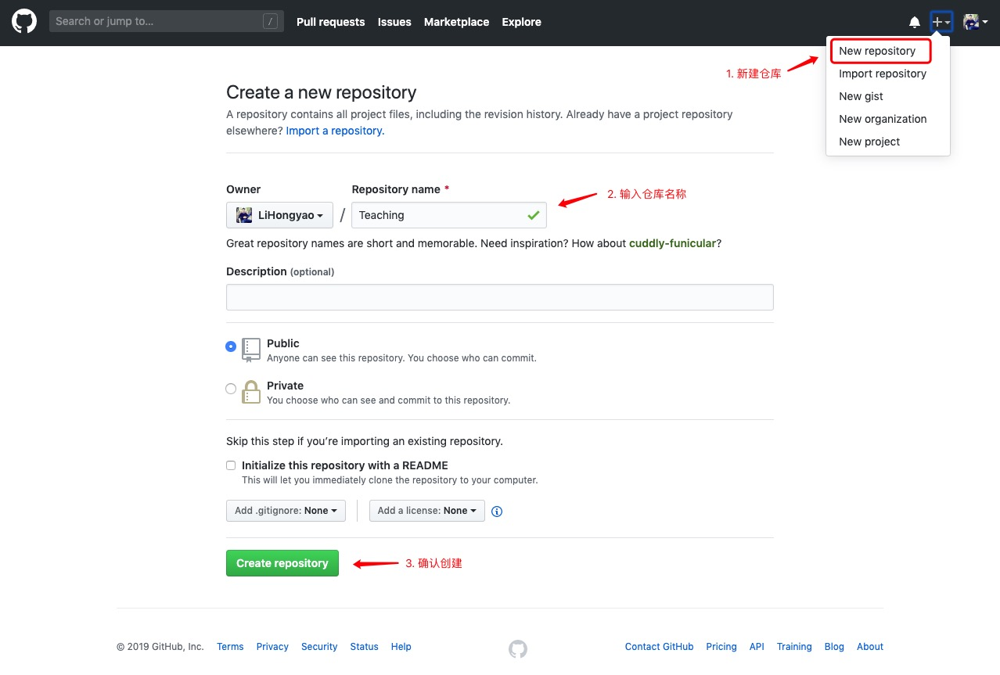
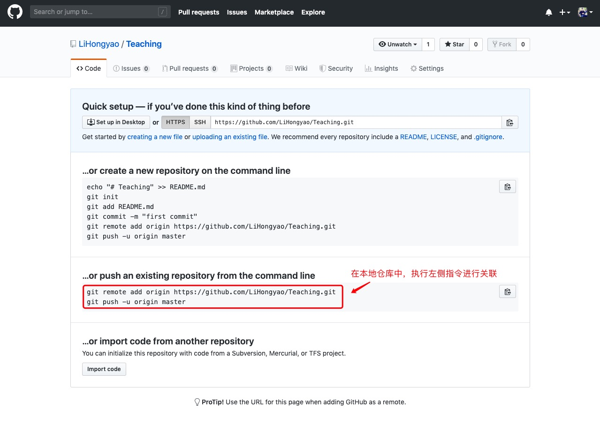

>  参考文献：
>
> 1. <https://git-scm.com/docs>
> 2. <http://www.bootcss.com/p/git-guide/>
> 3. <https://www.runoob.com/manual/github-git-cheat-sheet.pdf>

# 一、Git 概述

## 1、Git

Git是一个开源的 **分布式版本控制系统**，用于敏捷高效地处理任何或小或大的项目。

## 2、Git 诞生

Linus在1991年创建了开源的Linux，从此，Linux系统不断发展，已经成为最大的服务器系统软件了。

Linus虽然创建了Linux，但Linux的壮大是靠全世界热心的志愿者参与的，这么多人在世界各地为Linux编写代码，那Linux的代码是如何管理的呢？

事实是，在2002年以前，世界各地的志愿者把源代码文件通过diff的方式发给Linus，然后由Linus本人通过手工方式合并代码！

你也许会想，为什么Linus不把Linux代码放到版本控制系统里呢？不是有CVS、SVN这些免费的版本控制系统吗？因为Linus坚定地反对CVS和SVN，这些集中式的版本控制系统不但速度慢，而且必须联网才能使用。有一些商用的版本控制系统，虽然比CVS、SVN好用，但那是付费的，和Linux的开源精神不符。

不过，到了2002年，Linux系统已经发展了十年了，代码库之大让Linus很难继续通过手工方式管理了，社区的弟兄们也对这种方式表达了强烈不满，于是Linus选择了一个商业的版本控制系统BitKeeper，BitKeeper的东家BitMover公司出于人道主义精神，授权Linux社区免费使用这个版本控制系统。

安定团结的大好局面在2005年就被打破了，原因是Linux社区牛人聚集，不免沾染了一些梁山好汉的江湖习气。开发Samba的Andrew试图破解BitKeeper的协议（这么干的其实也不只他一个），被BitMover公司发现了（监控工作做得不错！），于是BitMover公司怒了，要收回Linux社区的免费使用权。

Linus可以向BitMover公司道个歉，保证以后严格管教弟兄们，嗯，这是不可能的。实际情况是这样的：

Linus花了两周时间自己用C写了一个分布式版本控制系统，这就是Git！一个月之内，Linux系统的源码已经由Git管理了！牛是怎么定义的呢？大家可以体会一下。

Git迅速成为最流行的分布式版本控制系统，尤其是2008年，GitHub网站上线了，它为开源项目免费提供Git存储，无数开源项目开始迁移至GitHub，包括jQuery，PHP，Ruby等等。

历史就是这么偶然，如果不是当年BitMover公司威胁Linux社区，可能现在我们就没有免费而超级好用的Git了。

## 3、分布式 VS 集中式

- 集中式版本控制系统，其版本库是集中存放在中央服务器上的，当需要的时候可以从中央服务器取得最新的版本，然后修改完毕之后再上传到中央服务器，类比图书馆借书修改的过程，但是其最大的不便之处就是必须要联网。

- 分布式版本控制系统，每个人的电脑上都是一个完整的版本库，所以不需要联网。例如你修改了文件1，你的同事在他的电脑上也修改了文件1，那么你们俩只需要把各自的修改推送给对方，就可以互相看到修改了。实际使用分布式版本控制系统的时候，其通常有一台“中央服务器”，但是这个服务器只是为了方便大家“交换”修改。例如两个人不在同一个局域网，两台电脑互相访问不了，又或者另外一人的电脑没开机等情况。

# 二、Git 安装

Git 各平台安装包下载地址为：<http://git-scm.com/downloads>

下载安装即可，安装好之后，输入指令，查看 git 安装位置及其版本。

```shell
$ which git
/usr/local/bin/git
$ git --version
git version 2.23.0
```

> 提示：windows 下需将 *which* 替换成 *where*.

## 1、配置用户信息

配置个人的用户名称和电子邮件地址：

```shell
$ git config --global user.name  "Your Name"
$ git config --global user.email "email@example.com"
```

## 2、查看配置信息 

输入指令

```shell
$ git config --list
```

# 三、Git 工作流

你的本地仓库由 git 维护的三棵“树”组成。第一个是你的 工作目录，它持有实际文件；第二个是 缓存区（Index），它像个缓存区域，临时保存你的改动；最后是 HEAD，指向你最近一次提交后的结果。


# 四、Git 基本操作 

- `git init`：创建版本库

- `git add .`：提交至缓存区
- `git commit -m ""`：提交至版本库
- `git status`：查看工作区状态
- `git diff`：查看修改
- `git restore <文件>`：丢弃工作区的改动
- `git restore --staged <文件>`：取消暂存
- `git log --pretty=oneline` ：查看历史版本
- `git reset --hard <commit-id>`：版本回退
- `git reflog`：查看命令历史
- `git rm <文件>`：删除文件

# 五、远程仓库

<https://github.com/>

由于你的本地Git仓库和GitHub仓库之间的传输是通过SSH加密的，所以，需要一点设置：

**第1步：**创建SSH Key。在用户主目录下，看看有没有.ssh目录，如果有，再看看这个目录下有没有 ”id_rsa“ 和 ”id_rsa.pub“ 这两个文件，如果已经有了，可直接跳到下一步。如果没有，打开Shell（Windows下打开Git Bash），创建SSH Key：

```shell
$ ssh-keygen -t rsa -C "youremail@example.com"
```

你需要把邮件地址换成你自己的邮件地址，然后一路回车，使用默认值即可，由于这个Key也不是用于军事目的，所以也无需设置密码。

如果一切顺利的话，可以在用户主目录里找到 ”.ssh“ 目录，里面有 ”id_rsa“ 和 ”id_rsa.pub” 两个文件，这两个就是SSH Key的秘钥对， ”id_rsa“  是私钥，不能泄露出去， ”id_rsa.pub” 是公钥，可以放心地告诉任何人。

> 提示：
>
> 在windows系统下，如果出现 “ssh-keygen” 不是内部或外部命令，解决的办法是：
>
> 1. 首先找到 “ssh-keygen” 的安装目录，一般位于 “C:\Program Files\Git\usr\bin” 下。
> 2. 将该路径添加环境变量的Path字段中。

**第2步：**

登陆Github -> 点击右上角个人头像 -> 点击Settings进入设置页面 ->

点击SSH and GPG keys选项 -> 点击右上角New SSH key ->  

在添加面板中，

Title：设置SSH key 标题，可任意填写

Key：将  *”id_rsa.pub”*  文件内容拷贝至此

然后点击 Add SSH Key 就可以看到你创建的SSH Key了，如下图所示：


为什么GitHub需要SSH Key呢？因为GitHub需要识别出你推送的提交确实是你推送的，而不是别人冒充的，而Git支持SSH协议，所以，GitHub只要知道了你的公钥，就可以确认只有你自己才能推送。

当然，GitHub允许你添加多个Key。假定你有若干电脑，你一会儿在公司提交，一会儿在家里提交，只要把每台电脑的Key都添加到GitHub，就可以在每台电脑上往GitHub推送了。

最后友情提示，在GitHub上免费托管的Git仓库，任何人都可以看到喔（但只有你自己才能改）。所以，不要把敏感信息放进去。

如果你不想让别人看到Git库，有两个办法，一个是交点保护费，让GitHub把公开的仓库变成私有的，这样别人就看不见了（不可读更不可写）。另一个办法是自己动手，搭一个Git服务器，因为是你自己的Git服务器，所以别人也是看不见的。这个方法我们后面会讲到的，相当简单，公司内部开发必备。

确保你拥有一个GitHub账号后，我们就即将开始远程仓库的学习。 

## 1、添加远程库

首先，登陆GitHub，然后，在右上角找到点击 `+` 按钮，再选择 “New Repository”  创建一个新的仓库：



关联远程仓库：



```shell
# 关联远程仓库
$ git remote add origin https://github.com/LiHongyao/Teaching.git
# 推送远程仓库
$ git push -u origin master
```

推送成功后，可以立刻在GitHub页面中看到远程库的内容。从现在起，只要本地作了提交，就可以通过如下命令更新远程仓库：

```shell
$ git push origin master
```

**SSH 警告**

当你第一次使用Git的`clone`或者`push`命令连接GitHub时，会得到一个警告：

```shell
The authenticity of host 'github.com (xx.xx.xx.xx)' can't be established.
RSA key fingerprint is xx.xx.xx.xx.xx.
Are you sure you want to continue connecting (yes/no)?
```

这是因为Git使用SSH连接，而SSH连接在第一次验证GitHub服务器的Key时，需要你确认GitHub的Key的指纹信息是否真的来自GitHub的服务器，输入`yes`回车即可。

Git会输出一个警告，告诉你已经把GitHub的Key添加到本机的一个信任列表里了：

```
Warning: Permanently added 'github.com' (RSA) to the list of known hosts.
```

这个警告只会出现一次，后面的操作就不会有任何警告了。

如果你实在担心有人冒充GitHub服务器，输入`yes`前可以对照[GitHub的RSA Key的指纹信息](https://help.github.com/articles/what-are-github-s-ssh-key-fingerprints/)是否与SSH连接给出的一致。

## 2、克隆远程库

在终端通过如下指令即可克隆远程仓库：

```shell
$ git clone <仓库地址>
```

仓库地址有如下两种形式：

```
1. https://github.com/用户名/仓库名.git
2. git@github.com:用户名/仓库名.git
```

> 提示：用第2中地址形式比第1中速度更快。

当你从远程仓库克隆时，实际上Git自动把本地的`master`分支和远程的`master`分支对应起来了，并且，远程仓库的默认名称是`origin`。

要查看远程库的信息，用 `git remote`：

```shell
$ git remote
origin
```

或者，用 `git remote -v` 显示更详细的信息：

```shell
$ git remote -v
origin	git@github.com:LiHongyao/GITProj.git (fetch)
origin	git@github.com:LiHongyao/GITProj.git (push)
```

上面显示了可以抓取和推送的 `origin` 的地址。如果没有推送权限，就看不到push的地址。

# 六、分支管理

## 1. 分支分类

1. master：主分支
2. dev：开发时所用的分支
3. bug：解决bug的分支
4. feature：开发新功能分支

## 2. 分支管理策略

在实际开发中，我们应该按照几个基本原则进行分支管理：

首先，`master` 分支应该是非常稳定的，也就是仅用来发布新版本，平时不能在上面干活；

那在哪干活呢？干活都在 `dev` 分支上，也就是说，`dev` 分支是不稳定的，到某个时候，比如1.0版本发布时，再把 `dev` 分支合并到 `master` 上，在 `master` 分支发布1.0版本；

你和你的小伙伴们每个人都在 `dev` 分支上干活，每个人都有自己的分支，时不时地往 `dev` 分支上合并就可以了。

所以，团队合作的分支看起来就像这样：


## 3. 分支图解                                                      

每次提交，Git都把它们串成一条时间线，这条时间线就是一个分支。截止到目前，只有一条时间线，在Git里，这个分支叫主分支，即 `master` 分支。`HEAD` 指向的就是当前分支。

一开始的时候，`master` 分支是一条线，Git用 `master`指向最新的提交，再用`HEAD`指向`master`，就能确定当前分支，以及当前分支的提交点：


每次提交，`master` 分支都会向前移动一步，这样，随着你不断提交，`master`分支的线也越来越长。

当我们创建新的分支，例如 `dev` 时，Git 新建了一个指针叫 `dev`，指向 `master` 相同的提交，再把 `HEAD` 指向 `dev`，就表示当前分支在 `dev` 上：


从现在开始，对工作区的修改和提交就是针对 `dev` 分支了，比如新提交一次后，`dev` 指针往前移动一步，而 `master` 指针不变：


假如我们在 `dev` 上的工作完成了，就可以把 `dev` 合并到 `master` 上。Git怎么合并呢？最简单的方法，就是直接把 `master` 指向 `dev` 的当前提交，就完成了合并.


合并完分支后，甚至可以删除`dev`分支。删除`dev`分支就是把`dev`指针给删掉，删掉后，我们就剩下了一条`master`分支：


## 4. 分支常用指令

- `git branch`：查看分支
- `git branch <name>`：创建分支
- `git checkout <name>`：切换分支
- `git checkout -b <name>`：创建并切换分支
- `git branch -d <name>`：删除分支
- `git branch -D <name>`：强行删除分支（用在分支还未合并就要删除的情况）
- `git merge <name>`：合并分支
- `git stash`：保存工作状态
- `git stash list`：查看保存的工作状态
- `git  stash pop`：恢复工作状态
- `git stash apply`：恢复工作状态
- `git stash drop`：删除工作状态

## 5. 解决冲突

比如在 master 分支和 feature 分支上同时对某个文件进行了修改并且提交，如下所示：


那我们在合并分支的时候就会遇到冲突的情况，遇到冲突之后，直接到冲突的文件解决冲突，然后再次 add + commit即可，此时，合并之后的结构如下：


现在，`master` 分支和 `feature`分支变成了下图所示：


通过如下指令可以查看分支的合并情况：

```shell
$ git log --graph --abbrev-commit --pretty=oneline
```

合并分支时，可添加 `--no-ff` 参数保留分支信息：

```shell
$ git merge --no-ff -m "合并信息" <分支名>
```

# 七、标签管理

发布一个版本时，我们通常先在版本库中打一个标签（tag），这样，就唯一确定了打标签时刻的版本。将来无论什么时候，取某个标签的版本，就是把那个打标签的时刻的历史版本取出来。所以，标签也是版本库的一个快照。

Git的标签虽然是版本库的快照，但其实它就是指向某个 commit 的指针（跟分支很像对不对？但是分支可以移动，标签不能移动），所以，创建和删除标签都是瞬间完成的。

Git有commit，为什么还要引入tag？

“请把上周一的那个版本打包发布，commit号是6a5819e...”

“一串乱七八糟的数字不好找！”

如果换一个办法：

“请把上周一的那个版本打包发布，版本号是v1.2”

“好的，按照tag v1.2查找commit就行！”

所以，tag就是一个让人容易记住的有意义的名字，它跟某个 commit 绑在一起。

## 1、创建标签

在Git中打标签非常简单，首先，切换到需要打标签的分支上：

```shell
$ git branch
* dev
  master
$ git checkout master
Switched to branch 'master'
Your branch is up to date with 'origin/master'.
```

然后，敲命令 `git tag <name>` 就可以打一个新标签：

```shell
git tag v1.0
```

可以用命令 `git tag` 查看所有标签：

```shell
$ git tag
v1.0
```

默认标签是打在最新提交的 commit 上的。有时候，如果忘了打标签，比如，现在已经是周五了，但应该在周一打的标签没有打，怎么办？

方法是找到历史提交的 “commit id”，然后打上就可以了：

```shell
$ git log --pretty=oneline --abbrev-commit
294f183 (HEAD -> master, tag: v1.0, origin/master, origin/HEAD) add info.md file
b57f9b7 add gg.md
3fa5948 change
775e8c8 change Test.txt
0b325f6 merged bug fix 101
341417c fix bug 101
b4537f9 add Test.txt
c2b5888 merge with no-ff
a5191b6 add hello
8e7e3d8 conflict fixed
103a7f9 & simple
3bf80e1 And simple
e433476 branch test
```

比方说，要为 “conflict fixed”  这次提交打标签，它对应的 “commit id” 是 “8e7e3d8” ，敲入命令：

```shell
$ git tag v0.8 8e7e3d8
$ git tag
v0.8
v1.0
```

> 注意：
>
> 标签不是按时间顺序列出，而是按字母排序的。

可以用 `git show <tagname>` 查看标签信息：

```shell
$ git show v0.8
commit 8e7e3d84ff9a84188d6ef7c5167260f1ee4d8648 (tag: v0.8)
Merge: 103a7f9 3bf80e1
Author: LiHongyao <lihy_online@163.com>
Date:   Wed Jan 17 15:49:42 2018 +0800

    conflict fixed

diff --cc README.md
index e4b9dd8,fb7801c..bd85a0e
--- a/README.md
+++ b/README.md
@@@ -1,2 -1,2 +1,2 @@@
  # GITProj
- Creating a new branch & quick.
 -Creating a new branch is quick AND simple.
++Creating a new branch is quick and simple.
```

可以看到，`v0.8` 确实打在  “conflict fixed”   这次提交上。

还可以创建带有说明的标签，用 `-a` 指定标签名，`-m` 指定说明文字：

```shell
$ git tag -a <tagName> -m <des> <commit id>
```

> 小结：
>
> 1. 创建标签 ：`git tag <tagName>`
> 2. 查看标签：`git tag`
> 3. 查看标签信息：`git show <tagName>`

## 2、操作标签

如果标签打错了，也可以删除：

```shell
$ git tag -d v1.0
Deleted tag 'v1.0' (was 294f183)
```

因为创建的标签都只存储在本地，不会自动推送到远程。所以，打错的标签可以在本地安全删除。

如果要推送某个标签到远程，使用命令 `git push origin <tagname>`：

```shell
$ git push origin v0.8
Total 0 (delta 0), reused 0 (delta 0)
To github.com:LiHongyao/GITProj.git
 * [new tag]         v0.8 -> v0.8
```

或者，一次性推送全部尚未推送到远程的本地标签：

```shell
$ git push origin --tags
Total 0 (delta 0), reused 0 (delta 0)
To github.com:LiHongyao/GITProj.git
 * [new tag]         v0.1 -> v0.1
 * [new tag]         v0.5 -> v0.5
```

如果标签已经推送到远程，要删除远程标签就麻烦一点，先从本地删除：

```shell
$ git tag -d v0.5
Deleted tag 'v0.5' (was 3bf80e1)
```

然后，从远程删除。删除命令也是push，但是格式如下：

```shell
$ git push origin :refs/tags/v0.5
To github.com:LiHongyao/GITProj.git
 - [deleted]         v0.5
```

要看看是否真的从远程库删除了标签，可以登陆GitHub查看。

> 小结：
>
> - 命令：`git push origin <tagname>`可以推送一个本地标签；
> - 命令：`git push origin --tags`可以推送全部未推送过的本地标签；
> - 命令：`git tag -d <tagname>`可以删除一个本地标签；
> - 命令：`git push origin :refs/tags/<tagname>`可以删除一个远程标签。

# 八、团队协作

## 1. 团队协作流程

stips 01 -> 创建远程仓库

stips 02 ->  Fork远程仓库

stips 03 -> 克隆远程仓库

stips 04 -> 正常业务功能

stips 05 -> 提交至远程仓库

stips 06 -> pull request

## 2. 抓取分支

多人协作时，大家都会往 `master` 和 `dev` 分支上推送各自的修改。

现在，模拟一个你的小伙伴，可以在另一台电脑（注意要把SSH Key添加到GitHub）或者同一台电脑的另一个目录下克隆：

```shell
$ git clone git@github.com:LiHongyao/GITProj.git
Cloning into 'GITProj'...
remote: Counting objects: 31, done.
remote: Compressing objects: 100% (16/16), done.
remote: Total 31 (delta 6), reused 27 (delta 5), pack-reused 0
Receiving objects: 100% (31/31), done.
Resolving deltas: 100% (6/6), done.
```

当你的小伙伴从远程库clone时，默认情况下，你的小伙伴只能看到本地的 `master` 分支。不信可以用 `git branch` 命令看看：

```shell
$ git branch
* master
```

现在，你的小伙伴要在 `dev` 分支上开发，就必须创建远程 `origin`的 `dev` 分支到本地，于是他用这个命令创建本地 `dev` 分支：

```shell
$ git checkout -b dev origin/dev
Branch 'dev' set up to track remote branch 'dev' from 'origin'.
Switched to a new branch 'dev'
```

现在，他就可以在 `dev`上继续修改，然后，时不时地把`dev`分支`push`到远程：

```shell
$ git add .
$ git commit -m "change README.md file"
[dev 4e078ab] change readme.md file
 1 file changed, 2 insertions(+)
 
$ git push origin dev
Counting objects: 3, done.
Delta compression using up to 4 threads.
Compressing objects: 100% (3/3), done.
Writing objects: 100% (3/3), 371 bytes | 371.00 KiB/s, done.
Total 3 (delta 0), reused 0 (delta 0)
To github.com:LiHongyao/GITProj.git
   294f183..4e078ab  dev -> dev
```

你的小伙伴已经向 `origin/dev` 分支推送了他的提交，而碰巧你也对同样的文件作了修改，并试图推送：

```shell
$ git add .
$ git commit -m "change readme.md with main."
[dev 5ee4d4a] change readme.md with main.
 1 file changed, 1 insertion(+)
$ git push origin dev
To github.com:LiHongyao/GITProj.git
 ! [rejected]        dev -> dev (fetch first)
error: failed to push some refs to 'git@github.com:LiHongyao/GITProj.git'
hint: Updates were rejected because the remote contains work that you do
hint: not have locally. This is usually caused by another repository pushing
hint: to the same ref. You may want to first integrate the remote changes
hint: (e.g., 'git pull ...') before pushing again.
hint: See the 'Note about fast-forwards' in 'git push --help' for details.
```

推送失败，因为你的小伙伴的最新提交和你试图推送的提交有冲突，解决办法也很简单，Git 已经提示我们，先用 `git pull` 把最新的提交从 `origin/dev` 抓下来，然后，在本地合并，解决冲突，再推送：

```shell
$ git pull
remote: Counting objects: 3, done.
remote: Compressing objects: 100% (3/3), done.
remote: Total 3 (delta 0), reused 3 (delta 0), pack-reused 0
Unpacking objects: 100% (3/3), done.
From github.com:LiHongyao/GITProj
   294f183..4e078ab  dev        -> origin/dev
   3fa5948..294f183  master     -> origin/master
There is no tracking information for the current branch.
Please specify which branch you want to merge with.
See git-pull(1) for details.

    git pull <remote> <branch>

If you wish to set tracking information for this branch you can do so with:

    git branch --set-upstream-to=origin/<branch> dev
```

`git pull` 也失败了，原因是没有指定本地 `dev` 分支与远程 `origin/dev` 分支的链接，根据提示，设置 `dev`和 `origin/dev`的链接：

```shell
$ git branch --set-upstream-to=origin/dev dev
Branch 'dev' set up to track remote branch 'dev' from 'origin'.
```

再pull

```shell
$ git pull
Auto-merging README.md
CONFLICT (content): Merge conflict in README.md
Automatic merge failed; fix conflicts and then commit the result.
```

这回 `git pull` 成功，但是合并有冲突，需要手动解决，解决的方法和分支管理中的 [解决冲突]()完全一样。解决后，提交，再push：

```shell
$ git add .
$ git commit -m "merge & fix README.md"
[dev e7f096d] merge & fix README.md

$ git push origin dev
Counting objects: 4, done.
Delta compression using up to 4 threads.
Compressing objects: 100% (3/3), done.
Writing objects: 100% (4/4), 515 bytes | 515.00 KiB/s, done.
Total 4 (delta 1), reused 0 (delta 0)
remote: Resolving deltas: 100% (1/1), done.
To github.com:LiHongyao/GITProj.git
   4e078ab..e7f096d  dev -> dev
```

因此，多人协作的工作模式通常是这样：

1. 首先，可以试图用 `git push origin branch-name` 推送自己的修改；
2. 如果推送失败，则因为远程分支比你的本地更新，需要先用 `git pull` 试图合并；
3. 如果合并有冲突，则解决冲突，并在本地提交；
4. 没有冲突或者解决掉冲突后，再用 `git push origin branch-name` 推送就能成功！

如果 `git pull` 提示 *“no tracking information”*，则说明本地分支和远程分支的链接关系没有创建，用命令:

```shell
$ git branch --set-upstream branch-name origin/branch-name
```

这就是多人协作的工作模式，一旦熟悉了，就非常简单。

> 小结
>
> 1. 查看远程库信息，使用 `git remote -v`；
> 2. 本地新建的分支如果不推送到远程，对其他人就是不可见的；
> 3. 从本地推送分支，使用 `git push origin branch-name`，如果推送失败，先用 `git pull` 抓取远程的新提交；
> 4. 在本地创建和远程分支对应的分支，使用 
>
> ```shell
> $ git checkout -b branch-name origin/branch-name
> ```
>
> 本地和远程分支的名称最好一致；
>
> 5. 建立本地分支和远程分支的关联，使用：
>
> ```shell
>  $ git branch --set-upstream branch-name origin/branch-name
> ```

## 3. 同步更新FORK仓库

如果fork源仓库更新了内容，要更新fork之后的内容，操作如下：

1. 查看远程信息

```shell
$ git remote -v
```

2. 添加远程库

```shell
$ git remote add upstream https://github.com/xxx/xxx(fork源仓库地址)
```

3. 从fork源仓库同步更新代码

```shell
$ git fetch upstream
```

4. 合并到本地代码

```shell
$ git merge upstream/master
```

5. 更新并合并自己远程仓库的代码

```shell
$ git pull origin master
```

6. 向自己远程仓库推送刚才同步源仓库后的代码

```shell
$ git push origin master
```

# 九、扩展

## 1. 可视化工具

下载id至：<https://desktop.github.com/>

## 2. GitHub Pages

我们可以将 **静态网页** 部署到 Github page，然后通过在线链接直接访问，具体操作如下：

第1步：创建一个仓库，命名为：`用户名.github.io`，比如：lihongyao.github.io

第2步：将静态网页直接存入该仓库，比如：lihongyao.github.io/proj

第3步：浏览器输入地址：https://lihongyao.github.io/proj/index.html

## 3. 码云

<https://gitee.com/>

# # git 指令大全

| 指令                                                     | 描述                 |
| -------------------------------------------------------- | -------------------- |
| `git init`                                               | 创建版本库           |
| `git add .`                                              | 添加文件至版本库     |
| `git commit`                                             | 提交文件至版本库     |
| `git status`                                             | 查看工作区状态       |
| `git diff`                                               | 查看修改             |
| `git log [--pretty=oneline] [--graph] [--abbrev-commit]` | 查看版本             |
| `git reflog`                                             | 查看所有历史版本     |
| `git reset --hard [commitID]`                            | 切换至指定版本       |
| `git checkout -- <file>`                                 | 撤销修改             |
| `git reset HEAD <file>`                                  | 移出暂存区           |
| `git rm <file>`                                          | 删除文件             |
| `git remote add origin <url>`                            | 关联远程仓库         |
| `git push [-u] origin master`                            | 推送至远程仓库       |
| `git clone <url>`                                        | 克隆远程仓库         |
| `git branch <name>`                                      | 查看/创建分支        |
| `git checkout <name>`                                    | 切换分支             |
| `git checkout -b <name>`                                 | 创建并切换分支       |
| `git merge [--no-ff] <name>`                             | 合并分支             |
| `git branch -d <name>`                                   | 删除分支             |
| `git branch -D <name>`                                   | 删除未合并的分支     |
| `git stash`                                              | 存储工作现场         |
| `git stash list`                                         | 查看存储的工作现场   |
| `git stash pop`                                          | 恢复工作现场(无痕迹) |
| `git stash apply`                                        | 恢复工作现场(有痕迹) |
| `git stash drop`                                         | 删除工作现场         |
| `git remote -v`                                          | 查看远程库信息       |
| `git push origin <branch-name>`                          | 推送本地分支至远程库 |
| `git tag <tag-name>`                                     | 创建标签             |
| `git tag`                                                | 查看标签             |
| `git show <tag-name>`                                    | 查看指定标签信息     |
| `git tag -d <tag-name>`                                  | 删除本地指定标签     |
| `git push origin :refs/tags/<tagname>`                   | 删除指定远程标签     |
| `git push origin <tag-name>`                             | 推送指定标签至远程库 |
| `git push origin --tags`                                 | 推送所有标签至远程库 |
|                                                          |                      |


