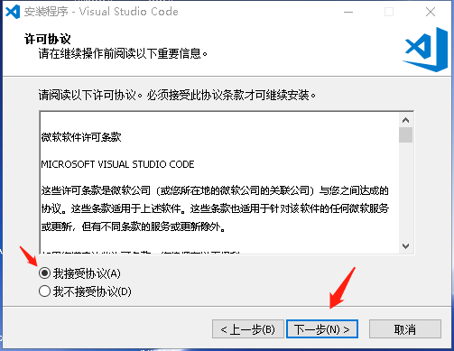
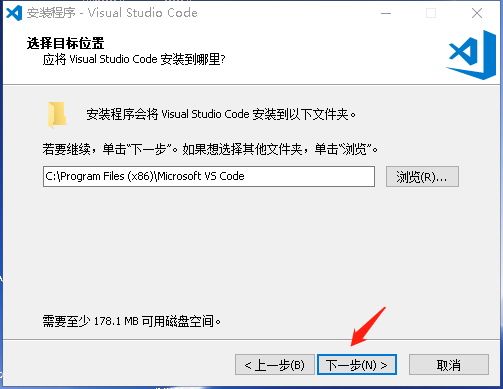
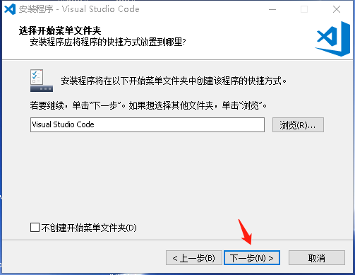
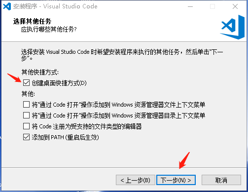
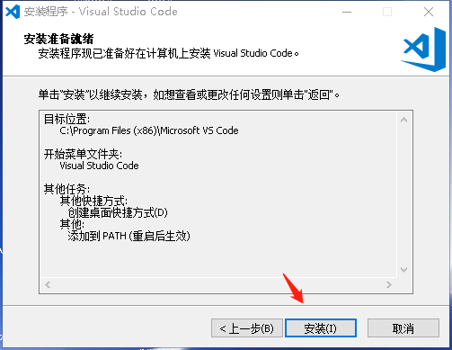
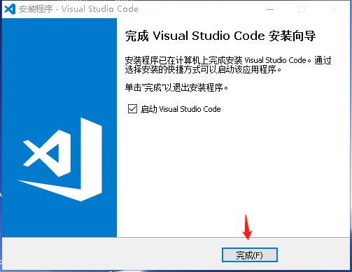
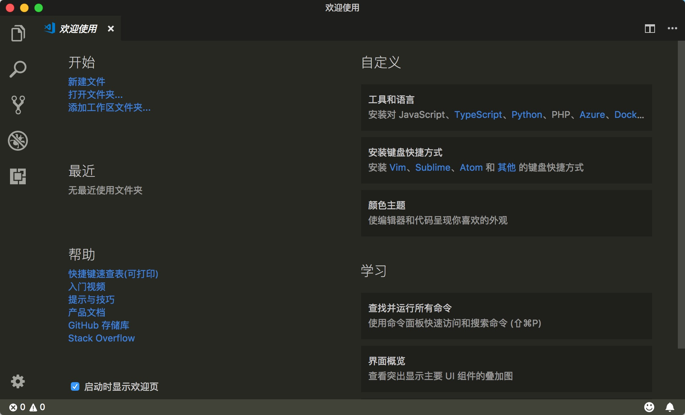

# # 下载

[点击前往下载 -> VSCode](https://code.visualstudio.com/Download)

> 提示：根据电脑系统环境下载

# # 安装

## 1. windows 环境安装

双击 .exe 文件进行安装

- stips 01：接受协议并点击下一步

- stips 02：选择安装盘符并点击下一步

- stips 03：选择开始菜单文件夹，直接点击下一步即可

- stips 04：勾选创建桌面快捷方式并点击下一步

- stips 05：点击安装

- stips 06：安装完成，点击完成

## 2. macOS 环境安装

> macOS 环境安装直接双击 .dmg 文件，将提示框中将VSCode拖进应用程序即可完成安装。

安装好后进入VSCode主界面，如下所示：

# # 插件安装

**> 进入扩展视图界面安装/卸载**

1. 使用快捷键：**Cmd+Shift+X**
2. 查看 -> 扩展
3. 点左侧边框的扩展图标按钮进入

> 提示：
>
> 在顶部搜索框输入你需要的扩展插件，找到之后在扩展插件后面的选项中点击**【安装】**即可，需要卸载扩展只需要点【卸载】即可。
>
> 扩展下载安装完毕之后需要点击**【启用】**才生效，有些扩展需要**重启编辑器**才生效。

**> 如何选择扩展插件？**

- 带 `snippets` 一般是代码提示类扩展；
- 带 `viewer` 一般是代码运行预览类扩展；
- 带 `support` 一般是代码语言支持；
- 带 `document` 一般是参考文档类扩展；
- 带 `Format` 一般是代码格式化整理扩展；

# # 用户设置

**> 用户设置入口**

1. 快捷键：**Cmd+,**
2. 文件 -> 首选项 -> 设置

> 提示：
>
> 编辑器会拆分为两列，一个文件是**【默认设置】**，一个是**【用户设置】**
>
> 进行用户设置的时候，可通过默认设置找到需要用户自定义的设置项，然后复制粘贴到用户设置里面修改成用户自定义值并保存即可。

# # 常用插件

> HTML 

| 插件名                    | 描述                  |
| ---------------------- | ------------------- |
| Open In Browser        | 运行 *.html 页面        |
| HTML Snippets          | 支持HTML5标签提示         |
| HTML Boilerplate       | 快速生成html模板          |
| HTML CSS support       | CSS自动补齐             |
| HTML Class Suggestions | 类名命名提示              |
| Auto Rename Tag        | 修改HTML标签时，自动修改匹配的标签 |
| Auto Close Tag         | 自动闭合HTML标签          |

> CSS

| 插件名                                      | 描述                                     |
| ---------------------------------------- | -------------------------------------- |
| CSS Peek                                 | 跟踪样式表中 CSS 类和 id 的样式，点击右键直接跳转到对应的css代码 |
| [IntelliSense for CSS class names](https://marketplace.visualstudio.com/items?itemName=Zignd.html-css-class-completion) | CSS类名智能命名提示                            |

> JS

| 插件名                       | 描述                   |
| ------------------------- | -------------------- |
| JavaScript (ES6) snippets | 支持JavaScript  ES6 语法 |
| jQuery Code Snippets      | jq代码段提示              |
| JavaScript Snippet Pack   | ES5常用操作DOM的语法代码块     |

> 综合

| 插件名               | 描述                                       |
| ----------------- | ---------------------------------------- |
| Beautify          | 格式化HTML、CSS、SCSS、JS文件                    |
| Path Intellisense | 自动补全路劲                                   |
| vscode-icons      | 侧栏的图标，对于一个有视觉强迫症的人是必须要的                  |
| vscode-fileheade  | 顶部注释模板，可定义作者、时间等信息，并会自动更新最后修改时间，快捷键：`ctr + alt + i` |
| Color-Highlight   | 在编辑器中高亮显示颜色                              |
| Better Comments   | 编写更加人性化的注释                               |
| Live Server       | 实时编译，在.html 中使用快捷键 ctr/cmd + L + O 即可启动，或者点击VSCode底部的 “Go Live” 即可。 |

> 调试

| 插件名                 | 描述                                       |
| ------------------- | ---------------------------------------- |
| Debugger for Chrome | js调试的插件，前端项目在Chrome中运行起来之后，可以直接在VSCode中打断点、查看输出、查看控制台，详细配置见插件说明。 |

# # 常用快捷键

## 1. 常用 `cmd+shift+?` 系列

| 快捷键          | 功能                |
| ------------ | ----------------- |
| cmd+shift+D  | 打开Debugger        |
| cmd+shift+K  | 删除光标所在的一整行        |
| cmd+shift+L  | 选择当前文件中所有你当前选中的词汇 |
| cmd+shift+F  | 打开全局搜索            |
| cmd+shift+M  | 打开你的问题面板          |
| cmd+shift+H  | 对当前文件的查询替换        |
| cmd+shift+S  | 文件另存为             |
| cmd+shift+T  | 打开最近关闭的那个文件       |
| cmd+shift+X  | 打开安装插件的入口         |
| cmd+shift+V  | 预览MarkDown        |
| cmd+shift+空格 | 参数提示              |
| cmd+shift+\  | 光标跳转到花括号闭合处       |

## 2. 常用的 `cmd+?` 系列

| 快捷键     | 功能            |
| ------- | ------------- |
| cmd+B   | 打开或者关闭侧边栏     |
| cmd+W   | 关闭当前窗口        |
| cmd+P   | 打开最近关闭的文件     |
| cmd+]/[ | 左右控制行缩进       |
| cmd+/   | 注释一行或取消当前行的注释 |
| cmd+F   | 查询在当前文件       |
| cmd+,   | 打开用户设置        |
| cmd+N   | 新建一个文件        |
| cmd+O   | 打开一个文件        |
| ctr+`   | 打开集成的终端       |

