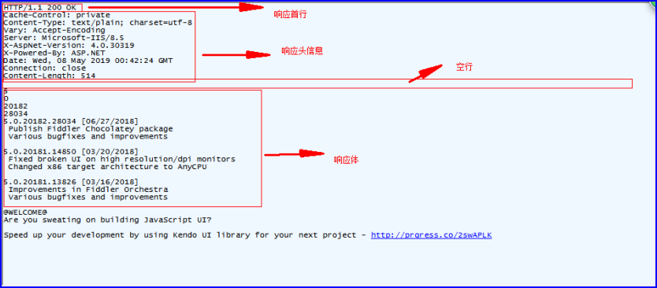
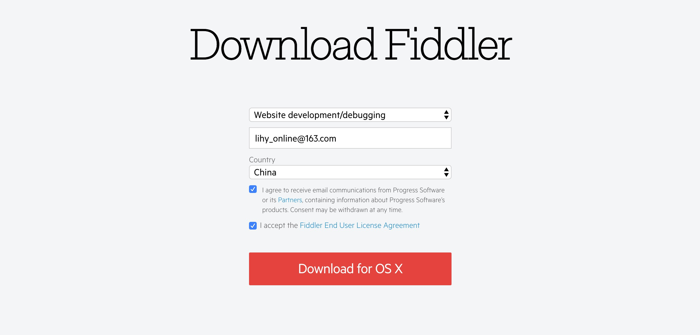

# 一、概述

- HTTP是Hyper Text Transfer Protocol（超文本传输协议）的缩写。它的发展是万维网协会（World Wide Web Consortium）和Internet工作小组IETF（Internet Engineering Task Force）合作的结果。
- HTTP协议是用于从WWW服务器传输超文本（网页）到本地浏览器的传送协议。它可以使浏览器更加高效，使网络传输减少。
- HTTP是一个应用层协议，由请求和响应构成，是一个标准的客户端服务器模型。
- HTTP是一个无状态的协议，同一个客户端的这次请求和上次请求没有任何关系，对http服务器来说，它并不知道这两个请求来自同一个客户端。 为了解决这个问题， Web程序引入了Cookie/session/websocket等来解决。
- 默认HTTP的端口号为80，HTTPS（更安全的http协议）的端口号为443。

**# 本质：**

HTTP就是一个通信规则，通信规则规定了客户端发送给服务器的内容格式，也规定了服务器发送给客户端的内容格式。其实我们要学习的就是这个两个格式！客户端发送给服务器的格式叫“请求协议”；服务器发送给客户端的格式叫“响应协议”。

# 二、Http协议在TCP/IP协议栈中的位置

HTTP是一个基于TCP/IP通信协议来传递数据（HTML 文件, 图片文件, 查询结果等）。

HTTP协议通常承载于TCP协议之上，有时也承载于TLS或SSL协议层之上，这个时候，就成了我们常说的HTTPS。如下图所示：


# 三、Http 请求响应模型

HTTP协议永远都是客户端发起请求，服务器回送响应。见下图：


这样就限制了使用HTTP协议，无法实现在客户端没有发起请求的时候，服务器将消息推送给客户端。

# 四、Http 特点

- **无状态协议**：就是说每次HTTP请求都是独立的，任何两个请求之间没有什么必然的联系。但是在实际应用当中并不是完全这样的，引入了Cookie和Session机制来关联请求。
- **应用层协议**：由请求和响应构成，是一个标准的客户端服务器模型
- **多次HTTP请求**：在客户端请求网页时多数情况下并不是一次请求就能成功的，服务端首先是响应HTML页面，然后浏览器收到响应之后发现HTML页面还引用了其他的资源，例如，CSS，JS文件，图片等等，还会自动发送HTTP请求这些需要的资源。现在的HTTP版本支持管道机制，可以同时请求和响应多个请求，大大提高了效率。
- **基于TCP**：HTTP协议目的是规定客户端和服务端数据传输的格式和数据交互行为，并不负责数据传输的细节。底层是基于TCP实现的。现在使用的版本当中是默认持久连接的，也就是多次HTTP请求使用一个TCP连接。

# 五、Http 工作流程

## 1. 服务器 -- 客户端

一次HTTP操作称为一个事务，其工作过程可分为四步：

1. 首先客户端与服务器需要 `建立连接` 。只要单击某个超链接，HTTP的工作就开始啦。


2. 建立连接后，客户端发送一个 `请求` 给服务器，请求方式的格式为：统一资源标识符（URL）、协议版本号，后边是MIME信息包括请求修饰符、客户端信息和可能的内容。


3. 服务器接到请求后，给予相应的 `响应` 信息，其格式为一个状态行，包括信息的协议版本号、一个成功或错误的代码，后边是MIME信息包括服务器信息、实体信息和可能的内容。
4. 客户端接收服务器所返回的信息通过浏览器显示在用户的 `显示` 屏上，然后客户端与服务器断开连接。

> 建立连接 -> 客户端发送请求 -> 服务器响应请求 -> 渲染

如果在以上过程中的某一步出现错误，那么产生错误的信息将返回到客户端，由显示屏输出。对于用户来说，这些过程是由HTTP自己完成的，用户只要用鼠标点击，等待信息显示就可以了。

## 2. 服务器 -- 代理 -- 客户端

我们的请求有可能是经过了代理服务器，最后才到达Web服务器的。过程如下图所示：


## 3. 代理服务器的作用

代理服务器就是网络信息的中转站，有什么功能呢？

1. 提高访问速度， 大多数的代理服务器都有缓存功能。
2. 突破限制， 也就是FQ（翻墙）了。
3. 隐藏身份。

# 六、URL详解

## 1. 说明

URL(Uniform Resource Locator) 地址用于描述一个网络上的资源，基本格式如下：

```
schema://host[:port#]/path/.../[?query-string][#anchor]
```

- schema：指定低层使用的协议(例如：http, https, ftp)
- host：HTTP服务器的IP地址或者域名
- port：Http服务器的默认端口是80，这种情况下端口号可以省略。如果使用了别的端口，必须指明
- path：访问资源的路径
- query-string：发送给Http服务器的数据
- anchor：锚

## 2. 示例

```js
"http://127.0.0.1:8081/weather?city=chengdu&date=2019-10-01#stuff"
```

- schema：http
- host：127.0.0.1
- port：8081
- path：/weather
- query-string：city=chengdu&date=2019-10-01
- anchor：stuff

# 七、Http 报文

有两种HTTP报文的类型，请求与响应，每种都有其特定的格式。

## 1. 请求报文（客户端发向服务端）

### 1.1. 说明

请求报文的格式如下：

```
请求行：请求方式 请求路径 协议和版本，例如：GET /index.html HTTP/1.1
请求头（消息报头）：请求头名称:请求头内容，即为key:value格式，例如：Host:localhost
空行：用来与请求体分隔开
请求体（请求正文）：GET没有请求体，只有POST有请求体。
```

浏览器发送给服务器的内容就这个格式的，如果不是这个格式服务器将无法解读。

### 1.2. 示例

**-> GET请求数据包**


**-> POST请求数据包**

多个了个空行和请求体


## 2. 响应报文（服务端发向客户端）

### 2.1. 说明

响应报文格式如下：

```
响应行（状态行）：响应协议和版本，状态码 状态消息 例如： HTTP/1.1 200 OK
响应头：响应头名称:响应头内容，即为key:value格式，例如：Connection:keep-alive
空行：用来与响应体分隔开
响应体（响应正文）：响应的内容
```

### 2.2. 示例

相应数据包



# 八、请求方法

根据HTTP标准，HTTP请求可以使用多种请求方法。

HTTP1.0定义了三种请求方法： GET, POST 和 HEAD方法。

HTTP1.1新增了五种请求方法：OPTIONS, PUT, DELETE, TRACE 和 CONNECT 方法。

| 方法    | 描述                                                         |
| ------- | ------------------------------------------------------------ |
| GET     | 请求指定的页面信息，并返回实体主体。                         |
| HEAD    | 类似于get请求，只不过返回的响应中没有具体的内容，用于获取报头 |
| POST    | 向指定资源提交数据进行处理请求（例如提交表单或者上传文件）。数据被包含在请求体中。POST请求可能会导致新的资源的建立和/或已有资源的修改。 |
| PUT     | 从客户端向服务器传送的数据取代指定的文档的内容。             |
| DELETE  | 请求服务器删除指定的页面。                                   |
| CONNECT | HTTP/1.1协议中预留给能够将连接改为管道方式的代理服务器。     |
| OPTIONS | 允许客户端查看服务器的性能。                                 |
| TRACE   | 回显服务器收到的请求，主要用于测试或诊断。                   |

# 九、状态码

## 1. 状态码是什么？

状态码用来告诉HTTP客户端，HTTP服务器是否产生了预期的Response.
HTTP/1.1中定义了5类状态码， HTTP状态码由三个十进制数字组成，第一个十进制数字定义了状态码的类型，后两个数字没有分类的作用。

当浏览者访问一个网页时，浏览者的浏览器会向网页所在服务器发出请求。当浏览器接收并显示网页前，此网页所在的服务器会返回一个包含HTTP状态码的信息头（server header）用以响应浏览器的请求。

## 2. 状态码类型

| 状态码 | 描述         | 说明                             |
| ------ | ------------ | -------------------------------- |
| 1xx    | 提示信息     | 表示请求正在处理                 |
| 2xx    | 成功         | 表示请求正常处理完毕             |
| 3xx    | 重定向       | 要完成请求必须进行更进一步的处理 |
| 4xx    | 客户端错误   | 请求有语法错误或请求无法实现     |
| 5xx    | 服务器端错误 | 服务器处理请求出错               |

## 3. 常见状态码

- `200`：请求成功，浏览器会把响应体内容显示在浏览器中。
- `404`：客户端问题，请求的资源没有找到，说明客户端错误的请求了不存在的资源。
- `500`：服务端问题，求资源找到了，但服务器内部发生了不可预期的错误。
- `301/302/303`：重定向

状态码参考地址：\<https://developer.mozilla.org/zh-CN/docs/Web/HTTP/Status\>

# 十、拦截请求 - Fiddler

Fiddler是位于客户端和服务器端之间的代理，也是目前最常用的抓包工具之一 。它能够记录客户端和服务器之间的所有 请求，可以针对特定的请求，分析请求数据、设置断点、调试web应用、修改请求的数据，甚至可以修改服务器返回的数据，功能非常强大，是web调试的利器。

点击前往下载页：https://www.telerik.com/download/fiddler



# 十一、无状态 VS Keep-Alive

无状态是指协议对于事务处理没有记忆能力，服务器不知道客户端是什么状态。从另一方面讲，打开一个服务器上的网页和你之前打开这个服务器上的网页之间没有任何联系。HTTP是一个无状态的面向连接的协议，无状态不代表HTTP不能保持TCP连接，更不能代表HTTP使用的是UDP协议（无连接）
从HTTP/1.1起，默认都开启了Keep-Alive，保持连接特性，简单地说，当一个网页打开完成后，客户端和服务器之间用于传输HTTP数据的TCP连接不会关闭，如果客户端再次访问这个服务器上的网页，会继续使用这一条已经建立的连接
Keep-Alive不会永久保持连接，它有一个保持时间，可以在不同的服务器软件（如Apache）中设定这个时间。

# 十二、浏览器输入地址到页面加载过程中该发生了什么？

从用户输入地址到浏览器加载界面，主要过程如下：

1. DNS解析
2. TCP连接
3. 发送HTTP请求
4. 服务器接收请求并响应
5. 浏览器解析并进行渲染
6. 连接结束

参考：

- https://www.cnblogs.com/hmchen/p/11298612.html
- https://www.cnblogs.com/lms0755/p/9053119.html

# 十三、总结

1. http协议全称，作用，是否有状态？
2. http协议是什么层协议？由那两部分构成？
3. http协议每部分对应的报文叫做什么？
4. http和https默认端口分别为多少？
5. http和tcp的关系？实际使用的四层架构是那四层？
6. 当http架构在什么上时，我们称之为https?
7. http协议工作流程（类似ajax流程），如果有代理呢？
8. 代理服务器的三个作用
9. URL的组成？请求报文与响应报文的格式？
10. 请求行/响应行（状态行）具体内容与含义
11. 状态码作用？有几类？由几位数组成？第几位数代表类别？
12. 状态码数量大概多少个，常见的有多少个？常见状态码有哪些? 304代表什么？
13. 常见请求头的类别，字段与作用；常见响应头的类别，字段与作用
14. HTTP协议是无状态的，然而Connection: keep-alive却又可以保持连接，这是否矛盾？